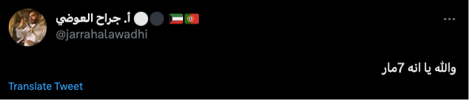
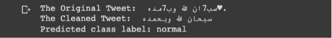
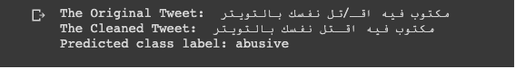

# Abusive Language Detection in Social Media

## Abstract
This project focuses on detecting abusive language in social media by developing a machine learning model to classify tweets as abusive or normal. It employs natural language processing (NLP) techniques and evaluates the performance of baseline models.

## Introduction
Our study addresses the challenge of detecting offensive and hate speech on social media. We use machine learning techniques to identify such content across different dialects. The approach includes preprocessing text data, feature extraction, and classification using models like Support Vector Classifier (SVC) and RandomForestClassifier.

## Approach
The process involves:
1. **Preprocessing:** Tokenization and stop word removal using NLTK.
2. **Feature Extraction:** Transforming text into numerical features with TF-IDF vectorizer.
3. **Classification:** Using SVC and RandomForest models, optimized through grid search.

The models are evaluated on metrics such as precision, recall, and F1-score.

## Experiments
We used the Arabic Levantine Hate Speech Detection dataset (L-HSAB) with 5,846 labeled political tweets.

## Setup
We employed a Support Vector Classifier (SVC) as our primary model, trained with optimized hyperparameters obtained through grid search.
   
To assess the performance of our approach, we conducted tests using real-time tweets from users.
**Examples:**

- **Ex1:**  
   
   
   

- **Ex2:**  
   
   
   

- **Ex3:**  
   
   
   

- **Ex4:**  
   

- **Ex5:**  
   
   
   

Based on our evaluation of real-time tweets, we observed distinctions between the two models. In examples 1, 2, and 3, both models demonstrated accurate classifications. However, in example 4, the models exhibited discrepancies when handling numbers adjacent to other numbers or when presented as ciphers. In example 5, the differing class predictions from each model allowed us to determine the superior model based on accuracy, as previously measured.

Results showed that SVC had higher accuracy (78%) but lower recall for 'abusive' speech. RandomForest achieved 76% accuracy but was better at detecting 'normal' tweets.

## Evaluation Metrics
**SVC Model Performance:** 
    
**RandomForest Model Performance:** 
  

## Results
The SVC model performed better overall with 78% accuracy but struggled with 'hate' speech. The RandomForest model had 76% accuracy and performed better on 'normal' tweets.

## Conclusion
Both models showed strengths and weaknesses. Future work should focus on expanding the dataset and improving feature engineering to better capture variations in offensive language.

## 🛠 Skills Used
Python, Natural Language Processing, Data Cleaning, Feature Extraction, Text Classification, Support Vector Classifier (SVC), RandomForestClassifier, TF-IDF Vectorizer, Grid Search, Model Evaluation, Precision, Recall, F1-Score

## 🚀 About This Project
Hi 👋, I'm Ahmed Munir

This project focuses on detecting abusive language in social media using machine learning techniques.

💬 Ask me about NLP, text classification, and machine learning models

📫 How to reach me: ahnather2@gmail.com

## 🔗 Links

